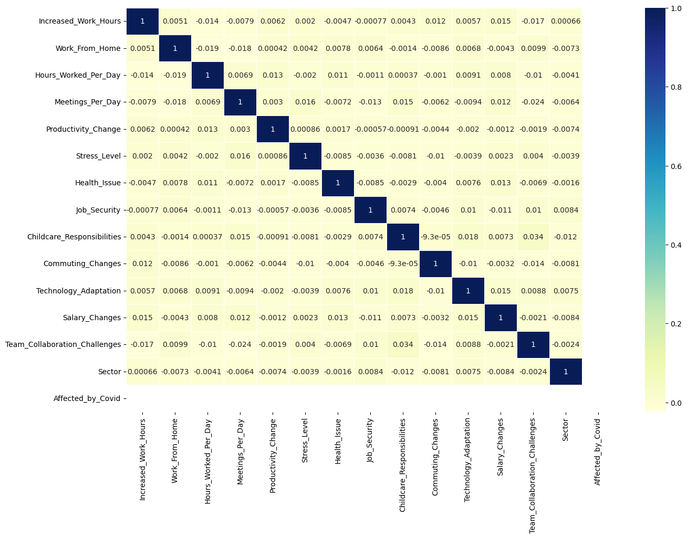
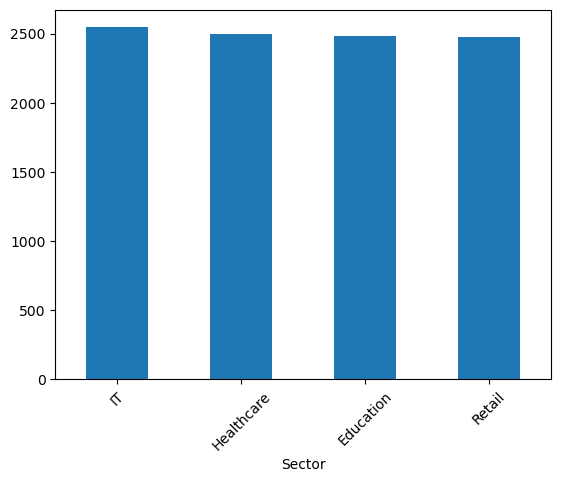
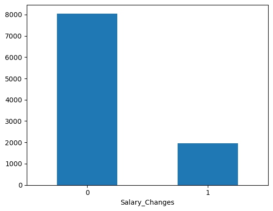
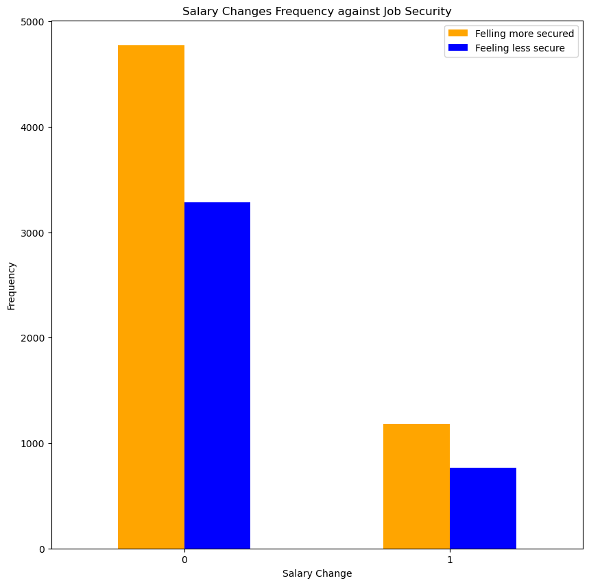
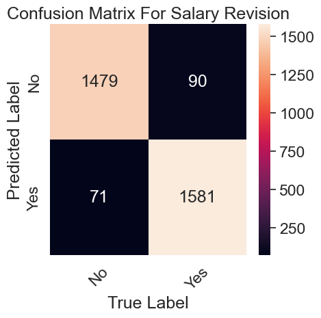
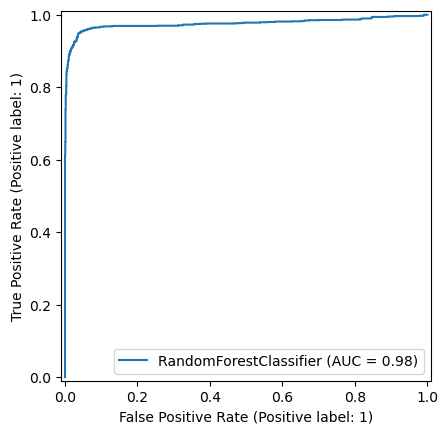
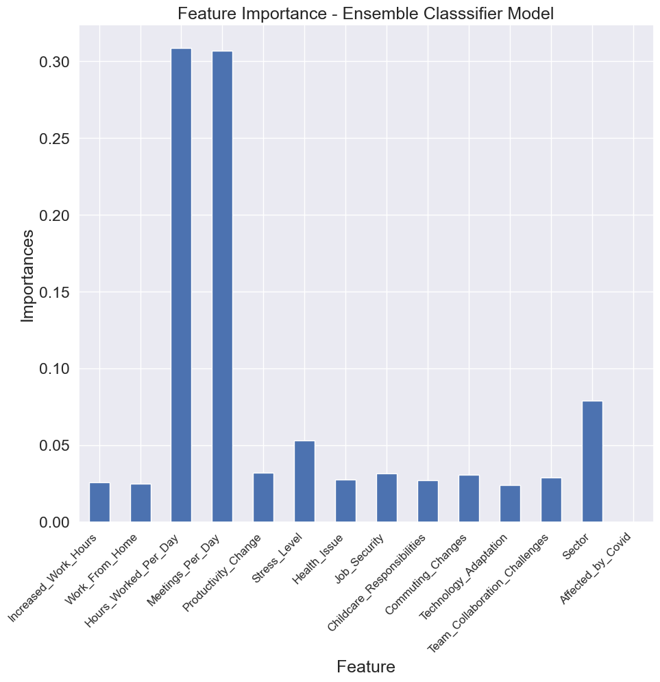
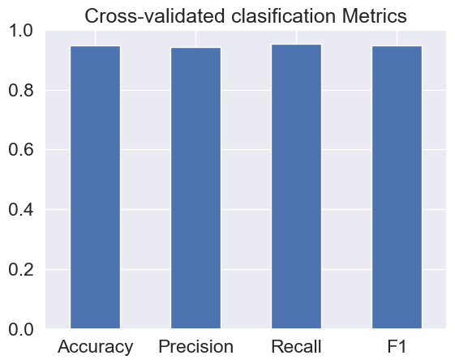

# Salary Review Predictor
This repository contains a `binary classification` project that uses various python based machine learning and data science libraries to build a machine learning model that predicts if a persons Salary has been reviewed post-covid pandamic. It takes into account the covid pandemic, working from home, adaptation to New Technology and other factors.  


## Table of Contents
+ Project Overview
+ Installation
+ Files
+ Acknowledgement

### Project Overview
The project started out as a `Job Security` predictor, but after much analysis and modelling it was concluded that the presented data was not substantiable enough to predict if a person's job was secured or not and also with the the fact that the covid pandemic made alot of people insecure about their positions in their offices. The data was carried out from four work sectors given in a figure below. The models created on the Job security after evaluation were seen to only be guessing and some got scores below guessing. It was imperative to find a new course of action which was predicting if with the circustances documented a person's salary was reviewed either for a reduction or an increase. The models performed greatly on the data when  predicting `Salary Revision`. 

- **Exploratory Data Analysis**: This involves going through the data using statistical tools like histogram, bargraphs, piecharts and so on. The dataset's columns and it's rows are scrutinized, checking for missing data, correlation, relationships and patterns. It also involves understanding the data and getting subject expert knowledge so that the problem can be solved as best as possible. Mode was used to fill categorical and Object datatypes, while Median was used to fill numerical datatypes.

**Correlation Matrix**

A correlation matrix helps understand relationships between numerical features. The values range from `-1` to `+1`, with `-1` meaning perfect negative correlation, `0` meaning no Linear relationship and `+1` meaning perfect positive correlation.
It helps picture how well our `target column` (`Salary_Changes`) relates with the other columns and how much each may contribute to the final decision. The corr() function found very little correlation between all our columns even the target coulumn, with all values lying between `0.01` and `-0.01`. 



**Frequency of each Sector**



**Frequency of each Salary Review Class**



**Frequency of each Salary Review Class Against Job Security**



- **Filling Missing Data**: This is a crucial part of the model creation purpose, Models cannot thoroughly learn from `Nan` values. The method of filling is crucial. Mode was used for non-numerical values and median for numerical datatypes.

- **Modelling and Model Evaluation**: This section involving applying machine learning models to our already clean dataset. In this project Ensemble's Random Forest Classifier, Logistic Regression, Linear SVC, SVC and KNN were all evaluated and tuned to know which found more pattern and learned better on the data. `Random Forest` excelled above the others, learned better in finding patterns and produced a baseline accuracy score of `94.815%` after augmentation of the data to fit in for the imbalance in class.

**Confusion Matrix**

A confusion matrix gives a breakdown of correct and incorrect classsifications for each category. It tells how and where the model is misclassifying and if a class is over- or under-predicted.




**ROC Curve and AUC score**

ROC(Receiver Operating Charactersistic) curve shows the trade-off between sensitivity (true positive rate) and specificity (1 - false positive rate). While the AUC (Area Under Curve) score summarises the ROC, with a score closer to 1 meaning a better model. They both help to tell us how imbalanced classes affect our model. It had an `AUC score` of `0.93`




**Feature Importance of Columns on Ensemble Model**

Feature importances shows how much each column contributed to the final prediction.




**Cross-Validation Evaluation**

Cross validation is applied to Accuracy, Precision, Recall and F1-score to show how much our model actually learns from our data by sampling it different ways and training and testing.




### Installation
1. **Anaconda**
	```bash
	 https://www.anaconda.com/download
	```
 

### Files
1. **Clone The Repository**
	```bash
	git clone https://github.com/Darc-lord/Salary-Review-Predictor.git
	cd Salary-Review-Predictor
	```

2. **Download Dataset**
	```bash
	 https://www.kaggle.com/datasets/gcreatives/impact-of-covid-19-on-working-professionals?resource=download
	```
